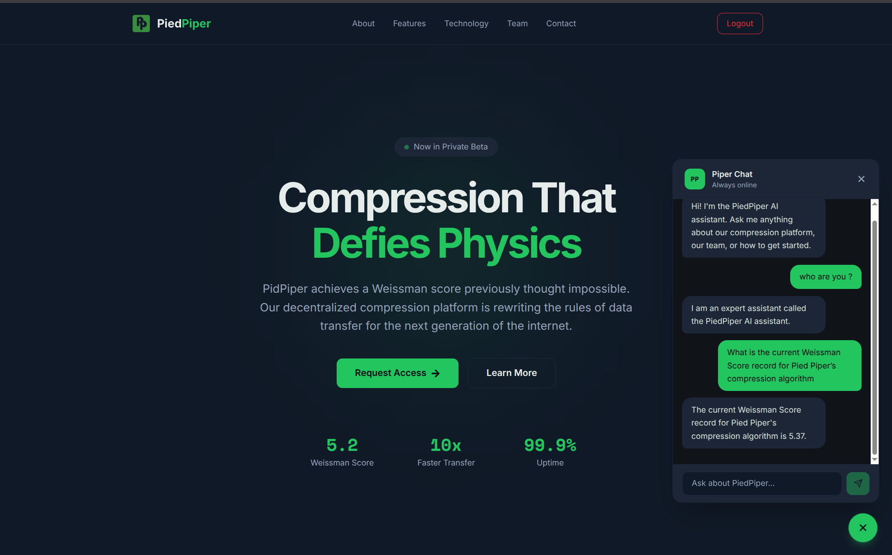
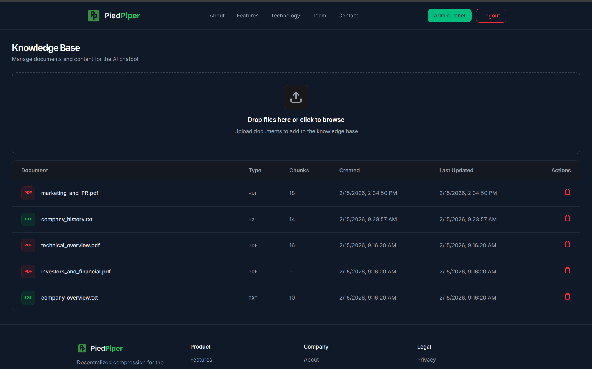
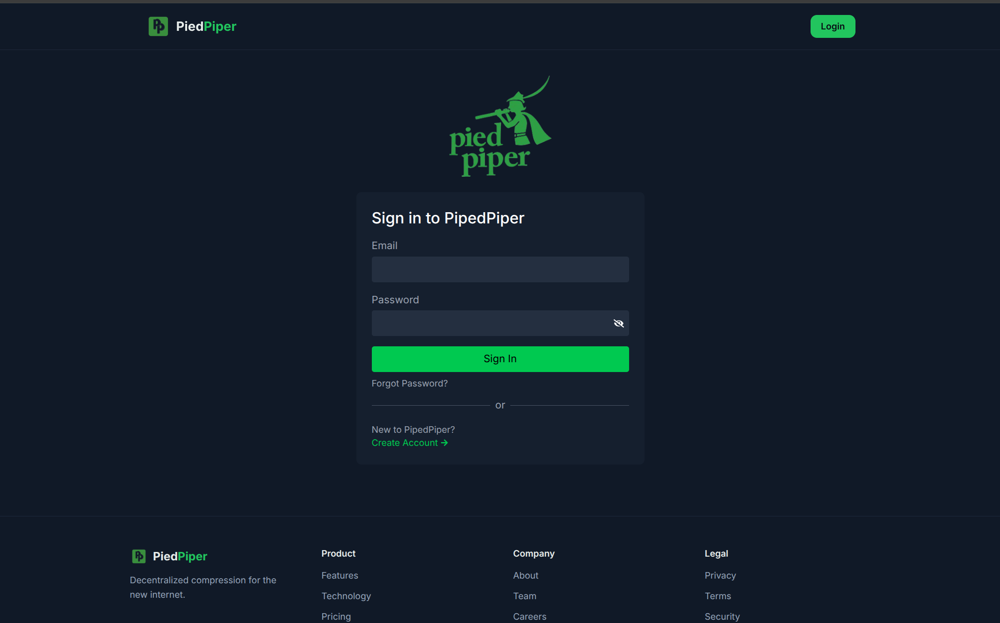

# RAG-Piper 🚀
> **Production-ready Full-Stack Retrieval-Augmented Generation (RAG) System**

---

## 🖼 Application Preview

### Landing Page
<p align="center">
  
</p>

### Admin Dashboard
<p align="center">
  
</p>

### login Interface
<p align="center">
  
</p>

---

## 🔍 What is RAG-Piper?

**RAG-Piper** is a full-stack **Retrieval-Augmented Generation platform** where:

- **Admins upload and manage documents**
- **Authenticated users query those documents via a RAG chatbot**

It models a **real internal knowledge system** used by clubs, startups, or teams
where content control is centralized, but access is distributed.

---

## ✨ Core Capabilities

### 👤 User
- Secure signup & login
- Access RAG chatbot after authentication


### 🛠 Admin
- Admin-only access (role-based)
- Upload **PDF / CSV / TXT** documents
- Manage and delete ingested documents
- Control the knowledge base


---

## 🔐 Authentication & Authorization Architecture

The system uses a **good auth flow**.

### Auth Design
- **Access Token**
  - Short-lived
  - Used for API authorization
- **Refresh Token**
  - Long-lived
  - Stored in **HttpOnly cookies**
- **Role-Based Access Control**
  - Admin vs User middleware

### Frontend Token Handling
- Axios instance with **automatic token refresh**
- Expired access tokens are silently refreshed


### Flow

```
Login
  │
  ▼
Access Token (Memory) + Refresh Token (HttpOnly Cookie)
  │
  ▼
Protected API Requests
  │
  ├─ Valid → Continue
  └─ Expired → respond 401
  │
  └─ Ask for New Token → New Access Token
```

---


---

## 📥 Ingestion Pipeline (Admin Only)

Runs **only when an Admin uploads documents**.

```
Admin Upload
(PDF / CSV / TXT)
        │
        ▼
Multer (Multi-file Upload)
        │
        ▼
LangChain Loaders & Normalization
(PDFLoader / CSVLoader / TextLoader)
        │        
        ▼
Text Splitting
(Recursive / Character)
        │
        ▼
Embedding Model
(voyage-3.5)
        │
        ▼
MongoDB Atlas
(Vector + Metadata)
```

### Stored Per Chunk
- Vector embedding
- Original text
- Document source ID (for deletion)

---

## 🔎 Retrieval Pipeline (User Query → Answer)

Runs **on every authenticated user question**.

```
User Question
     │
     ▼
Query Embedding
(voyage-3.5)
     │
     ▼
MongoDB Atlas Vector Search
     │
     ▼
Top-K Relevant Chunks
     │
     ▼
Prompt Construction
(Context + Question)
     │
     ▼
LLM Inference
(Gemini / DeepSeek)
     │
     ▼
Final Answer
```

---

## 🧰 Retrieval Pipeline – Tools Used

| Stage             | Tool                        |
| ----------------- | --------------------------- |
| Query Embedding   | Voyage-3.5                  |
| Vector Search     | MongoDB Atlas Vector Search |
| Context Selection | Top-K Similarity            |
| Prompt Building   | Custom Prompt Templates     |
| Primary LLM       | Gemini                      |
| Secondary LLM     | DeepSeek (Hugging Face)     |
| Chat Persistence  | MongoDB                     |

---

## 🧱 Tech Stack

### Frontend
- React
- Vite
- Axios 
- Context API

### Backend
- Node.js
- Express
- JWT (Access + Refresh)
- Role-based middleware
- Multer

### AI / RAG
- LangChain
- Voyage-3.5 Embeddings
- Gemini
- DeepSeek (Hugging Face)

### Database
- MongoDB Atlas
- Vector Search Index

---

## ☁ Deployment (AWS)

- **Frontend**
  - Hosted on **AWS S3**
  - Public static hosting

- **Backend**
  - Hosted on **AWS EC2**
  - Managed with **PM2**
  - Secure environment variables

```
S3 (React)
   │
   ▼
EC2 (Express API)
   │
   ▼
MongoDB Atlas
```

---

## 📂 Project Structure

```
RAG-Piper/

├── client/
│   ├── public/
│   └── src/
│       ├── API/
│       │   └── axiosInstance.js
│       ├── components/
│       ├── context/
│       ├── pages/
│       ├── services/
│       ├── App.jsx
│       └── main.jsx
└── server/
    ├── app.js
    ├── config/
    │   └── db.js
    ├── controllers/
    ├── routes/
    ├── middleware/
    │   ├── verifyJWT.middleware.js
    │   ├── role.middleware.js
    │   └── upload.middleware.js
    ├── models/
    ├── services/
    │   ├── ingestion/
    │   └── chat/
    ├── data/uploads/
    └── utils/split.js
```

---

## 🚀 Local Setup

```bash
git clone https://github.com/amirethio/RAG-Piper.git
cd RAG-Piper
```

### Backend
```bash
cd server
npm install
node --watch app.js / npm run dev
```

### Frontend
```bash
cd client
npm install
npm run dev
```

---

## 🔑 Environment Variables

Create a `.env` file inside the **server/** directory.

```env
PORT=3600
MONGO_URI=
ACCESS_SECRET_KEY=
REFRESH_SECRET_KEY=
VOYAGE_API_KEY=
GEMINI_API_KEY=
HF_API_KEY=
```

### Notes
- Secrets are **never committed** to the repository
- Refresh tokens are stored in **HttpOnly cookies**
- Environment variables are injected at runtime on AWS EC2

---

## 🧠 Why This Project Matters

This is **not a demo chatbot**.

RAG-Piper demonstrates:
- Real-world RAG pipelines
- Vector database design
- Secure auth with refresh tokens
- Role-based system design
- Cloud deployment on AWS

---

---
## 📜 License

MIT © Amir Ali
